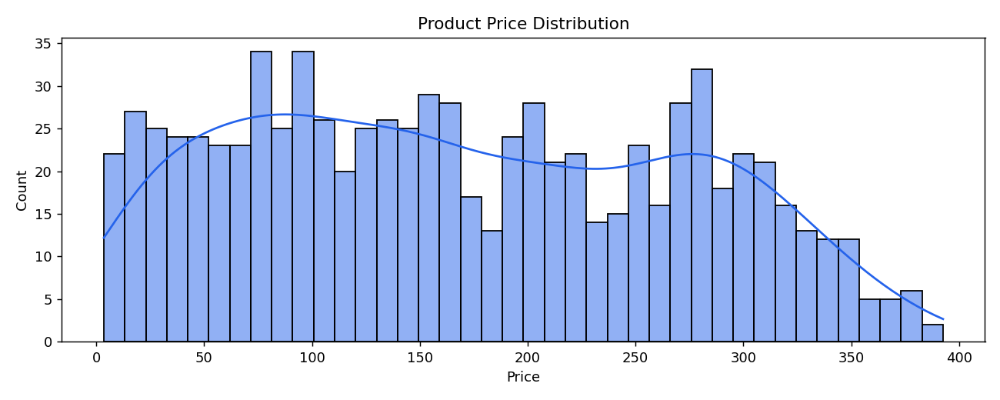
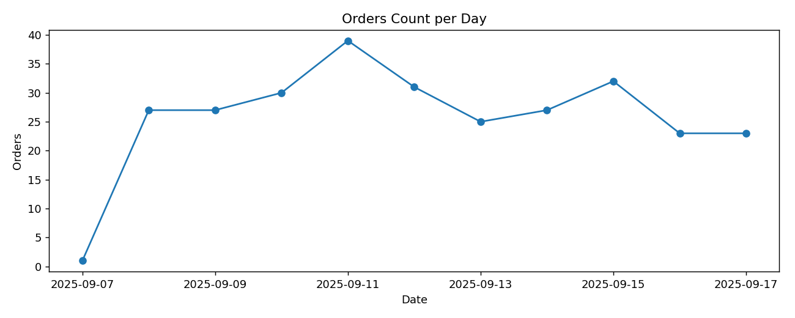

# Comparative Data Report
Generated: 2025-09-18T19:11:24.036435+00:00

## Products Summary
Total products: **825**
Distinct sources: **3**
Top category: **Electronics**
Price min: **3.52** | median: **159.97** | mean: **169.39** | p90: **308.76** | max: **392.59**
Duplicate logical key pairs: **232** (64.44% of keys)
Outlier price ratio (IQR fence): **0.00%** (lower=-178.92, upper=519.67)

**Products by Source (Top 10)**

| Source | Count | % |
|--------|-------|----|
| ebay | 364 | 44.12% |
| shopify | 319 | 38.67% |
| amazon | 142 | 17.21% |

## Orders Summary
Total orders: **285**
Timespan (days): **9**
GMV total: **202023.95** | mean: **708.86** | median: **627.05**

**Orders by Source (Top 10)**

| Source | Count | % |
|--------|-------|----|
| shopify | 285 | 100.00% |

## Enriched Product Features
Derived columns: category_freq, price_amount, price_currency, source_freq

## Enriched Order Features
Derived columns: aov_7d, gmv_7d, order_value_num, orders_7d, recency_days

## Comparative Narrative
The product dataset establishes the commercial catalog footprint (source diversity, category concentration and price dispersion), while the
orders dataset captures temporal demand and monetary performance. Provider (source) breakdowns reveal distribution of catalog and demand.

Engineered features enable downstream tasks:
- Price segmentation and elasticity exploration (`price_bucket`, `price_log`).
- Supplier/source reliability & concentration (`source_freq`).
- Momentum & short‑term commercial monitoring (`gmv_7d`, `orders_7d`, `aov_7d`).
- Lifecycle / churn proxy via recency (`recency_days`).

Data Quality & Risk Observations:
- Outlier ratios contextualize pricing anomalies for potential cleansing or curation steps.
- Duplicate logical key pairs (source + source_id) indicate upstream id uniformity or merge correctness.
- Run log metrics (new_* vs updated_*) help track incremental ingestion health; rising updated/new ratio may signal dataset maturity or stagnation.

Recommended Next Steps:
1. Establish anomaly thresholds for price outliers and rolling GMV deltas.
2. Persist daily aggregate tables for BI dashboards.
3. Integrate simple forecasting (e.g., 7d GMV moving average horizon extension) for operations planning.

## Data Availability Matrix
| Dataset | Rows | Enriched |
|---------|------|----------|
| Products | 825 | Yes |
| Orders | 285 | Yes |
